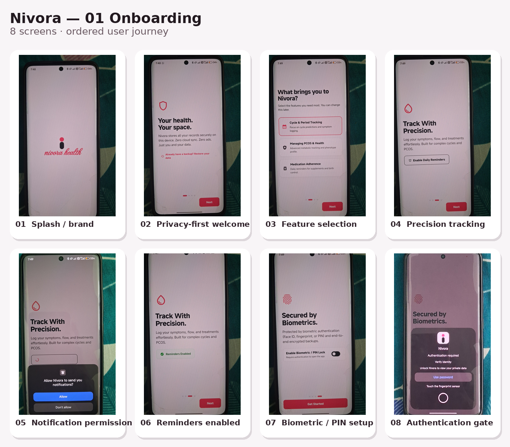
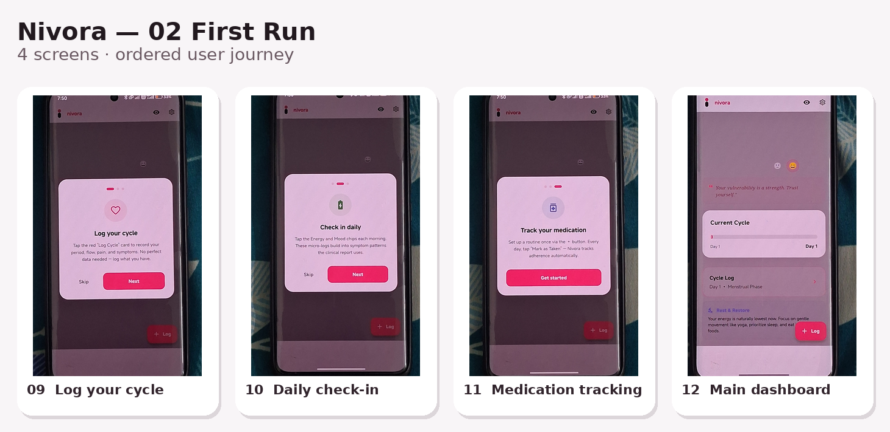
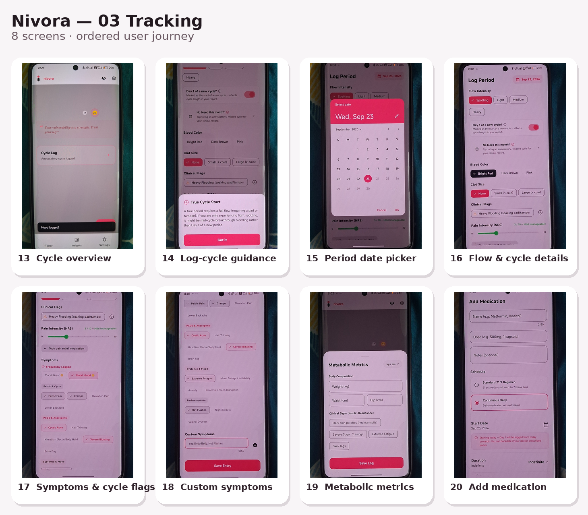
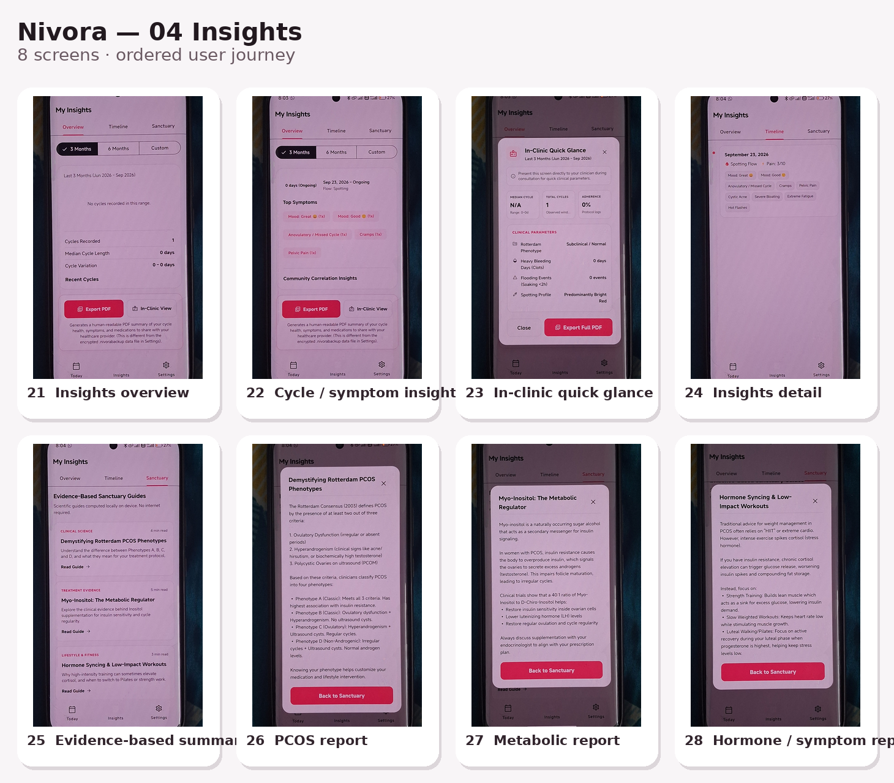
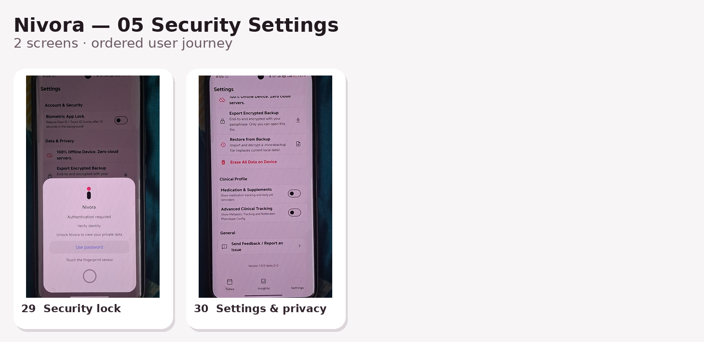
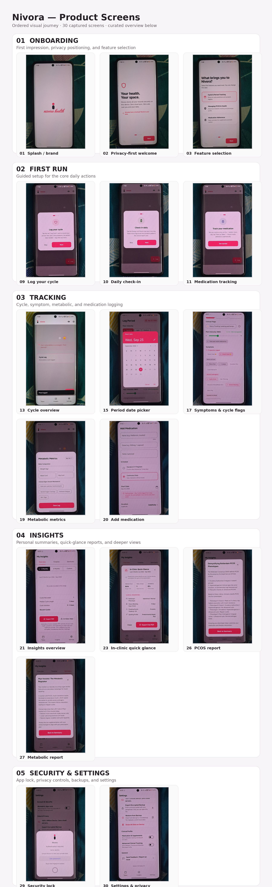

# Nivora

> A privacy-first women's health companion focused on cycle tracking, symptom logging, medication adherence, and personal health insights.

Nivora is designed around a simple flow: **log what is happening → build a useful history → review patterns and reports → keep sensitive data protected.**

## ✨ What the current UI demonstrates

- **Cycle tracking** — period and cycle logging, flow details, pain, symptoms, and cycle flags
- **Daily check-ins** — quick energy and mood logging
- **Medication adherence** — medication setup and taken/not-taken tracking
- **Health context** — PCOS-oriented and metabolic tracking surfaces
- **Insights** — summaries, timelines, in-clinic quick-glance views, and report-style detail screens
- **Privacy & security** — biometric/PIN app lock, authentication gates, backup/restore controls, and privacy settings
- **Notifications** — explicit permission flow for daily reminders

> **Important:** These screenshots document the current product UI. They do not, by themselves, establish clinical accuracy, medical efficacy, encryption implementation, or regulatory compliance. Those claims should be backed by the actual implementation and appropriate validation before release.

---

## 🧭 Product Flow

```text
Onboarding
    ↓
First-run guidance
    ↓
Cycle + symptom tracking
    ↓
Medication / health logging
    ↓
Insights & reports
    ↓
Privacy + security controls
```

### 1. Onboarding

Introduces Nivora, its privacy positioning, feature selection, reminder permissions, and biometric/PIN protection.



### 2. First Run

Guides the user through the three recurring actions at the heart of the product: logging a cycle, checking in daily, and tracking medication.



### 3. Tracking

The tracking experience expands from the cycle overview into date selection, flow details, symptoms and clinical flags, metabolic metrics, and medication setup.



### 4. Insights

Logged data is surfaced through overview, timeline, quick-glance, and deeper report-style views, including PCOS-oriented and metabolic content.



### 5. Security & Settings

The final flow covers the authentication gate plus settings for privacy, backups, data controls, and clinical-tracking preferences.



---

## 📸 Product Overview

A compact visual overview of the main journey is included below. The full section collages above preserve the complete 30-screen sequence.



---

## 🔐 Privacy & Security Surface

The current UI visibly includes:

| Area | Current UI surface |
|---|---|
| App access | Biometric / PIN lock and authentication gate |
| Data controls | Privacy settings, local data controls, erase-data option |
| Backup | Encrypted-backup export and restore controls |
| Notifications | Explicit notification permission flow |
| Clinical privacy | Settings for medication and advanced clinical tracking |

The wording above describes **visible product surfaces**, not a security audit. Implementation details should be verified against the codebase before being presented as guarantees.

---

## 🧩 Feature Map

| Product area | Screens / flow |
|---|---|
| Onboarding | Welcome, feature selection, reminders, biometrics |
| Cycle tracking | Cycle overview, period date, flow, cycle details |
| Symptoms | Pain, symptoms, cycle flags, custom symptoms |
| Daily check-in | Energy and mood |
| Medication | Add medication and adherence workflow |
| Health context | PCOS-oriented and metabolic tracking |
| Insights | Overview, timeline, quick glance, reports |
| Security | App lock, authentication, privacy/settings |

---

## 🛠️ Project Status

The repository should be treated as an **active product build**. Keep this README synchronized with the implementation as APIs, persistence, authentication, analytics, and deployment evolve.

For a recruiter or reviewer, the most useful path through the project is:

1. Review the product flow above.
2. Open the individual screenshot collages for the complete UI sequence.
3. Inspect the implementation and architecture in the repository.
4. Verify each documented capability against the current code.

---

## 📂 Repository Layout

```text
Nivora/
├── README.md
├── assets/
│   └── screenshots/
│       ├── 01_onboarding.png
│       ├── 02_first_run.png
│       ├── 03_tracking.png
│       ├── 04_insights.png
│       ├── 05_security_settings.png
│       └── Nivora_Screenshot_Overview.png
└── ...
```

---

## 📌 Screenshot Index

| Sequence | Section | Screens |
|---|---|---:|
| 01 | Onboarding | 8 |
| 02 | First Run | 4 |
| 03 | Tracking | 8 |
| 04 | Insights | 8 |
| 05 | Security & Settings | 2 |
| **Total** | **Complete captured journey** | **30** |

