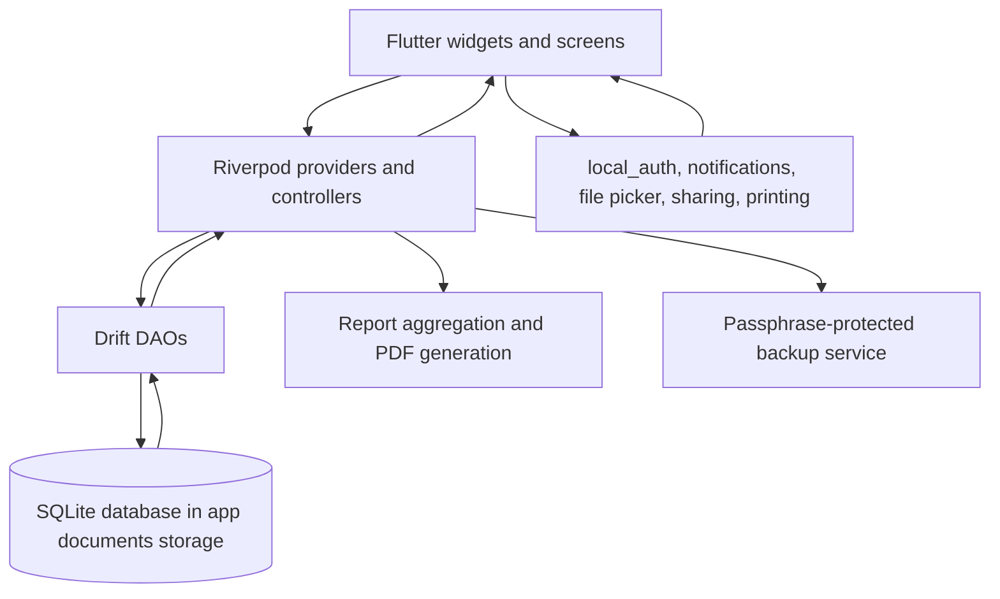
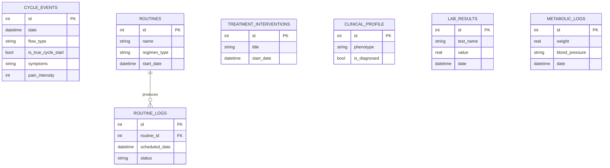

# Nivora

**A privacy-conscious, local-first health companion for cycle, symptom, routine, and personal health tracking.**

[](https://flutter.dev/)
[](https://dart.dev/)
[](LICENSE)
[](#technology-stack)

Nivora is a verified working prototype that helps a person record recurring health information in one place, review it over time, and prepare a concise summary for a healthcare conversation. The current application is a Flutter mobile app backed by a local Drift and SQLite database. It is designed to work without a cloud account or a production network service.

**Contents:** [Why Nivora](#why-nivora-exists) | [Features](#what-nivora-does) | [Product flow](#product-flow) | [Screenshots](#screenshots) | [Architecture](#architecture) | [Privacy](#privacy-and-security) | [Setup](#getting-started) | [Roadmap](#roadmap)

## Product overview

The repository currently contains implementation and test evidence for the product flow below. The screenshot pack referenced by earlier project notes is not included in this checkout, so screenshot sections are documented as placeholders rather than represented with invented images.

```text
Onboarding
    |
    v
First-run guidance
    |
    v
Cycle and symptom logging ----> Daily check-ins
    |                                  |
    v                                  v
Personal health context ------> Routines and reminders
    |
    v
Insights, history, and PDF summary
    |
    v
Access and data-management controls
```

## Why Nivora exists

Menstrual and reproductive health information is often split across memory, notes, calendars, medication reminders, and healthcare visits. A person may want to remember cycle starts, flow changes, pain, symptoms, mood, energy, medication, supplements, routines, lab results, or other context without losing the relationship between those observations.

Nivora treats these observations as a longitudinal record. The goal is not to diagnose a condition. The goal is to make personal information easier to capture, organize, review, and discuss.

This problem matters to more than the person entering the data. Partners, family members, caregivers, and developers working on sensitive health software all benefit from better health literacy and more careful treatment of private information. Nivora is designed to support the person using it while keeping control of the record with that person.

## Who it is for

Nivora is primarily intended for people who want to:

- track menstrual cycles, flow, symptoms, and pain;
- record medication, supplements, routines, and adherence;
- maintain longer-term personal health context;
- review patterns without depending on a cloud account; or
- prepare an information-rich summary for a healthcare discussion.

The repository is also relevant to developers studying local-first mobile applications, privacy-sensitive UX, relational domain modeling, and offline document generation.

## What Nivora does

The table distinguishes implemented behavior from visible UI surfaces and future work. A screen or label alone is not treated as proof of a backend guarantee.

| Area | Current implementation | Evidence and limits |
|---|---|---|
| Cycle and symptom tracking | Stores cycle events, flow, symptoms, pain, spotting, and cycle-start classification in Drift tables. | Implemented in `lib/core/database` and covered by database and controller tests. |
| Daily health context | Provides screens and data models for daily clinical and metabolic observations. | Implemented in the current source; exact available fields depend on the selected screen and schema. |
| Routines and adherence | Stores routines and routine logs, including daily or cyclic schedules. | Implemented in `routine_dao.dart`, controllers, and notification tests. |
| Insights and reports | Aggregates cycle history, symptom timing, pain scores, treatment comparisons, and related report data. | Implemented calculation logic exists. These summaries are not medical diagnoses or clinical validation. |
| PDF export | Generates a local PDF summary using the `pdf` and `printing` packages. | Implemented and tested with offline HTTP overrides. |
| Reminders | Schedules local notifications for daily or cyclic routines. | Implemented with inexact Android scheduling. Delivery still depends on platform permissions and power management. |
| Biometric access | Uses `local_auth` to request device authentication. | Implemented at the app layer. Hardware enrollment and device behavior still require physical-device validation. |
| App privacy overlay | Obscures the app when it moves into background lifecycle states. | Implemented and covered by `app_mask_test.dart`. This does not prevent all forms of device compromise. |
| Backup and restore | Exports the local tables to a passphrase-protected backup and restores them transactionally. | Version 2 uses PBKDF2 and AES-256-GCM. Legacy V1 import remains supported. |
| Data deletion | Clears operational tables and uses SQLite secure-delete and vacuum operations where implemented. | Verify the current platform storage behavior before treating this as forensic-grade destruction. |
| Cloud sync and analytics | No production network client, analytics SDK, or cloud synchronizer was found in the reviewed application source. | Android debug configuration contains Flutter's development INTERNET permission. Confirm release manifests when shipping. |

## Product flow

1. **Onboarding:** the app collects initial preferences and requests notification access through the onboarding flow.
2. **First-run guidance:** the user is introduced to the main tracking surfaces and available health context.
3. **Logging:** cycle events, symptoms, pain, routines, and daily observations are saved to the local database.
4. **Review:** Riverpod providers stream database changes back into the UI. The cycle and report features derive summaries from stored history.
5. **Export:** the user can create a local PDF summary or an encrypted backup for a destination they choose.
6. **Protection:** biometric authentication and the lifecycle privacy overlay reduce casual access and shoulder-surfing risk.

## Screenshots

The expected screenshot pack is not present in the current repository checkout. The repository therefore does not claim that screenshots prove any feature. Add captured images under [`assets/screenshots/`](assets/screenshots/) when they are available.

### 01. Onboarding

Planned evidence slot for the first-run setup, preference selection, and notification permission flow.

### 02. First run

Planned evidence slot for the initial guidance and main navigation surface.

### 03. Tracking

Planned evidence slot for cycle logging, symptom entry, daily check-ins, and routines.

### 04. Insights

Planned evidence slot for history, report summaries, charts, and local PDF export entry points.

### 05. Privacy and security

Planned evidence slot for biometric access, privacy controls, backup and restore, and data-management actions.

## How it works

Nivora follows a local application loop:

1. Flutter widgets collect user input.
2. Riverpod controllers coordinate screen state and application actions.
3. Drift DAOs read and write typed SQLite tables.
4. Database streams notify the UI when stored observations change.
5. Report services calculate summaries from the local history.
6. PDF and backup services serialize selected local data without a cloud dependency.
7. Platform plugins provide biometrics, notifications, file picking, sharing, and printing.

## Architecture



The data path is intentionally local in the reviewed application source. The Android release manifest disables Android cloud backup. The platform security model still applies, and the database is **not** protected by SQLCipher.

See [`docs/ARCHITECTURE.md`](docs/ARCHITECTURE.md) for the database entities and implementation notes.

## Domain model

The current Drift schema contains these main areas:



The schema is versioned through Drift migrations. Database version 6 includes cycle events, routines, routine logs, treatment interventions, lab results, clinical profile data, and metabolic logs.

## Privacy and security

Nivora handles sensitive health information, so security claims in this repository are tied to code and platform configuration rather than UI wording alone.

### Verified in the reviewed source

- Primary data is stored in a local Drift and SQLite database under the platform application documents directory.
- The Android release manifest sets `android:allowBackup="false"` and `android:fullBackupContent="false"`.
- The production application source contains no HTTP client, analytics endpoint, or cloud synchronization service. The Android debug manifest retains Flutter's development INTERNET permission.
- Backup export derives a 32-byte key with PBKDF2 using HMAC-SHA-256, 100,000 iterations, and a random 16-byte salt, then encrypts with AES-256-GCM using a random 12-byte nonce and a 128-bit authentication tag.
- Restore validates the authenticated payload before replacing database contents inside a transaction.
- Biometric prompts use the `local_auth` package. The app mask responds to lifecycle changes.
- The app uses local notifications for routine reminders. It does not send reminder data to a remote service.

### Important limits

- The operational database is standard SQLite, not SQLCipher-encrypted. Protection at rest depends on the mobile operating system sandbox and device-level storage protection.
- A passphrase-protected backup is only as strong as the passphrase and the user's handling of the exported file.
- Legacy V1 `.imyrabackup` files are accepted for compatibility and use the older unauthenticated backup format. Prefer the current `.nivorabackup` format for new exports.
- Physical-device testing remains required for biometrics, app-switcher masking, notification delivery, file import, and platform-specific storage behavior.
- No security audit, regulatory certification, HIPAA compliance, GDPR compliance, or clinical validation is claimed by this repository.

See [`SECURITY.md`](SECURITY.md) for reporting guidance and scope.

## Health and medical disclaimer

Nivora is a tracking and information-management application. Its logs, calculations, and report-style summaries are not medical diagnoses and are not a substitute for professional care. Users should discuss concerning symptoms, medication decisions, and health results with a qualified healthcare professional.

## Technology stack

| Layer | Technology | Role |
|---|---|---|
| Mobile UI | Flutter and Dart | Android and iOS application shell and screens |
| State | Flutter Riverpod and generated providers | Dependency injection, reactive state, and controller coordination |
| Persistence | Drift, SQLite, `sqlite3_flutter_libs` | Typed local relational storage and migrations |
| Authentication | `local_auth` | Device biometric or platform authentication prompt |
| Notifications | `flutter_local_notifications` and `timezone` | Local routine reminders |
| Backup | `pointycastle`, `encrypt`, `file_picker`, `share_plus` | Key derivation, authenticated encryption, import, and export |
| Reports | `pdf`, `printing` | Offline PDF generation and platform print/share integration |
| Testing | `flutter_test`, `integration_test` | Unit, widget, database, service, and integration coverage |
| Build | Flutter tooling, Gradle, Xcode project files | Android and iOS builds |

## Getting started

### Prerequisites

Install Flutter with a Dart SDK compatible with the constraint in [`pubspec.yaml`](pubspec.yaml), plus Android Studio for Android development or Xcode on macOS for iOS development. A physical device or emulator is needed for platform-plugin checks.

### Install dependencies

```bash
flutter pub get
```

### Generate Drift and Riverpod code

Run this after changing database tables, DAOs, or annotated providers:

```bash
dart run build_runner build --delete-conflicting-outputs
```

### Run static analysis and tests

```bash
dart analyze
flutter test
```

The integration test suite is separate and requires a configured Flutter device:

```bash
flutter test integration_test
```

### Run the app

```bash
flutter run
```

### Build Android artifacts

```bash
flutter build apk --release
flutter build appbundle --release
```

Android release signing requires a local `android/key.properties` and private keystore. Start from [`android/key.properties.example`](android/key.properties.example), and never commit credentials or keystore files.

## Testing and quality evidence

The repository includes database migration, data-integrity, backup round-trip, notification, report aggregation, widget, state, security overlay, and offline PDF tests. `test/offline_verification_test.dart` installs an HTTP override that fails if PDF generation attempts a network request.

The exact test count should be taken from the command output for the current checkout. This README intentionally does not publish a fixed count or coverage percentage.

Device-dependent checks remain open in [`docs/RELEASE_READINESS.md`](docs/RELEASE_READINESS.md), including biometric enrollment, app-switcher masking, notification behavior, Android file picking, iOS compilation, and printing.

## Repository structure

```text
Nivora/
├── android/                 Android project, manifest, signing template, and Gradle files
├── assets/                  Bundled fonts, branding, data, and screenshot documentation
├── docs/                    Architecture, release, validation, and operational notes
├── integration_test/       Device-level Flutter integration tests
├── ios/                    iOS project and platform configuration
├── lib/
│   ├── core/                Database, services, providers, notifications, and theme
│   ├── features/            Onboarding, cycle, today, routines, reports, and settings
│   └── l10n/                English, Spanish, and Hindi localization resources
├── test/                   Unit, widget, database, and service tests
├── CONTRIBUTING.md
├── SECURITY.md
├── LICENSE
├── README.md
└── pubspec.yaml
```

## Engineering notes

### Local relational storage

A typed Drift schema gives the application explicit migrations and DAO boundaries while keeping the primary record on the device. The trade-off is that the app must own migration compatibility and does not receive cloud synchronization automatically.

### Versioned encrypted backups

Backup export uses a versioned envelope so the format can evolve without silently misreading older files. The current V2 format adds authenticated encryption. Restore replaces the current tables only after decryption and payload validation succeed.

### Same-day event merging

Cycle logging uses upsert and merge behavior for repeated entries on the same date. This protects existing flow or symptom attributes when a user records additional context later in the day.

### Inexact reminders

Routine reminders use platform-scheduled local notifications. Android uses `inexactAllowWhileIdle`, which avoids requiring exact-alarm access but means delivery may shift with device power-management policies.

## What this project demonstrates

The current repository demonstrates Flutter mobile development, relational domain modeling with Drift, Riverpod state management, database migrations, local notification workflows, biometric access, offline PDF generation, authenticated backup export, localization, and privacy-sensitive product documentation. It also demonstrates the importance of separating UI evidence from verified security and medical claims.

## Roadmap

### Current

The working prototype includes local cycle and health logging, routine tracking, report aggregation, local PDF export, local reminders, biometric access, app masking, encrypted backup V2, migrations, and automated tests.

### Next

- Complete Android and iOS physical-device validation.
- Add the missing product screenshot pack to `assets/screenshots/`.
- Expand accessibility and localization review on real devices.
- Document backup recovery and key-handling expectations for end users.
- Add continuous integration for analysis, generated-code consistency, and tests.

### Future

- Improve report customization and export review.
- Add more structured health-context fields where they are justified by user needs.
- Evaluate a stronger at-rest database encryption strategy.
- Improve clinician-friendly summaries without presenting them as clinical validation.
- Review platform expansion only after the Android and iOS experience is stable.

## Contributing

Read [`CONTRIBUTING.md`](CONTRIBUTING.md) before opening a pull request. Changes that affect health calculations, privacy controls, backup formats, or database migrations should include focused tests and documentation updates.

## Security

Please do not disclose a suspected vulnerability in a public issue. Follow the private reporting process in [`SECURITY.md`](SECURITY.md).

## License

Nivora is licensed under the Business Source License 1.1. See [`LICENSE`](LICENSE) and [`CONTRIBUTING.md`](CONTRIBUTING.md) for the permitted-use terms and change date.

## References

The documentation structure was informed by public README guidance and privacy-first cycle-tracking projects. These are design references, not evidence for Nivora's implementation claims.

[1]: https://github.com/banesullivan/README "How to write a good README"
[2]: https://github.com/jfr3000/drip "Drip open-source cycle tracking app"
[3]: https://github.com/adulbrich/ephira "Ephira local-first period tracker"
[4]: https://flutter.dev/ "Flutter documentation"
[5]: https://drift.simonbinder.eu/ "Drift documentation"
[6]: https://riverpod.dev/ "Riverpod documentation"

[1] [2] [3] [4] [5] [6]
