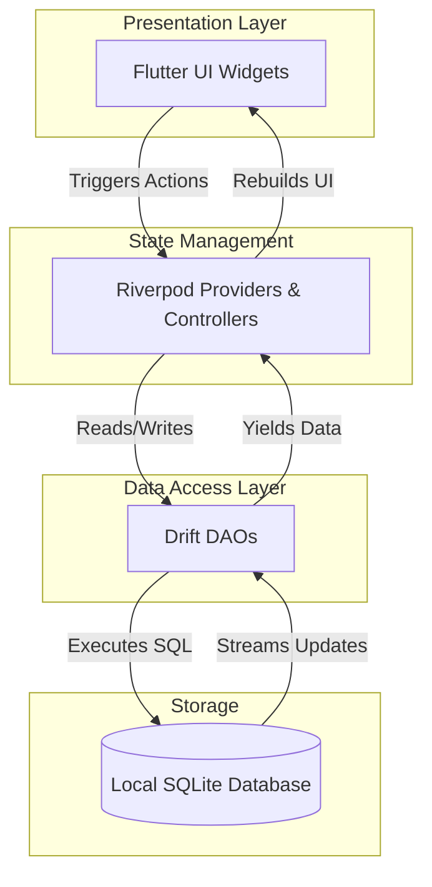
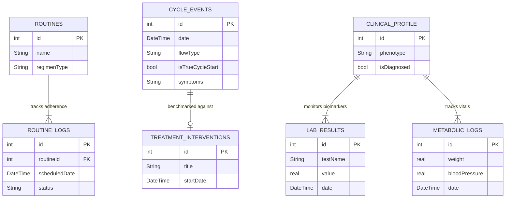

# Imyra Architecture

Imyra is built on a 100% local-first, offline architecture designed to maximize user privacy and clinical utility.

## 1. System Architecture Flow

## 2. Database Schema (Drift / SQLite)
Imyra relies on a relational, type-safe SQLite database powered by `drift`.

### Core Tables & Relationships:
- **`CycleEvents`**: The central table for logging flows, symptoms, and pain. The `isTrueCycleStart` flag differentiates between actual menstrual phase starts (Day 1) and mid-cycle spotting, ensuring median cycle lengths and PMDD predictions are mathematically sound. Uses `@TableIndex` on `date` for 10-year query optimization.
- **`TreatmentInterventions`**: Logs medical interventions (e.g., "Started Metformin"). This table is cross-referenced against `CycleEvents` to calculate "Pre-Treatment" vs "Post-Treatment" benchmarks (median cycle length, heavy bleeding days).
- **`Routines` & `RoutineLogs`**: `Routines` defines the regimen (e.g., `Cyclic_21_7` or `Daily`), while `RoutineLogs` tracks the daily adherence (`Taken`, `Missed`). Uses `@TableIndex` on `scheduledDate`.
- **`ClinicalProfile`, `LabResults`, `MetabolicLogs`**: Phenotype-centric tables specifically designed to support long-term PCOS management and metabolic tracking.

## 3. Security, Privacy & Export
- **App Masking**: The `ImyraApp` lifecycle observer instantly flips an obscuring boolean when the app goes into the `paused` or `inactive` state, hiding clinical data from the iOS/Android app switcher.
- **Biometric Gate (`local_auth`)**: Every time the app resumes or starts, it triggers `AuthService.authenticate()`, blocking the UI until FaceID or Fingerprint is provided (gracefully failing open to PIN if biometrics fail).
- **AES-256 Encrypted Backups (`encrypt`, `share_plus`)**: The `BackupService` utilizes `compute` Isolates to query the entire SQLite dataset, serialize it to JSON, and encrypt it. The encryption engine employs a strict **PBKDF2 key derivation** algorithm (100,000 SHA-256 iterations) with a secure random 16-byte salt to derive the 32-byte key from the user's passphrase. The data is then encrypted via AES-256 and written to a `.imyrabackup` file exported through the native OS share sheet.

## 4. State Management (Riverpod)
- **Dependency Injection**: Riverpod provides global access to the `AppDatabase` and its associated DAOs (`CycleDao`, `RoutineDao`, `ReportDao`).
- **Reactive UI**: The UI listens to database changes via StreamProviders (e.g., watching all logs for today). When the user taps "Mark as Taken", the Controller modifies the database, and the StreamProvider automatically pushes the new state to the UI without manual `setState` calls.
- **Business Logic Separation**: Controllers (like `TodayController` and `ReportController`) handle the heavy lifting (date math, PDF generation) and sit completely separate from the Widget tree.

## 5. UI & Polish (`flutter_animate`)
- **Micro-Animations**: All primary components (`CycleGraph`, `QuickLogSheet`, `OnboardingScreen`) are augmented with `flutter_animate` to chain fading, sliding, and scaling animations without the boilerplate of Flutter `AnimationController`s.
- **PCOS Guardrails**: The `CycleGraph` component dynamically measures the screen width using a `LayoutBuilder` and visually caps anomalous cycles (45-120 days) rather than overflowing, alerting the user with an `Imyra Rose` warning badge.
