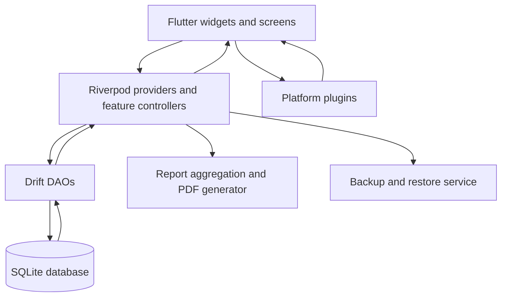

# Nivora architecture

Nivora is a Flutter mobile application whose primary data path is local. The application uses Riverpod for state coordination, Drift for typed SQLite access, and platform plugins for authentication, notifications, file selection, sharing, and printing.

## Application flow

The reviewed release application source contains no cloud synchronization, analytics endpoint, or production HTTP client. The Android debug manifest includes Flutter's development INTERNET permission, so release manifests should be checked as part of every release audit.

## Persistence

`AppDatabase` is a Drift database with schema version 6. It opens `nivora_health.sqlite` under the application documents directory. The migration strategy creates the current tables and upgrades older schemas, including a legacy `Ila_health.sqlite` file migration path.

The main tables are:

| Table | Purpose |
|---|---|
| `cycle_events` | Cycle dates, flow, symptoms, pain, and cycle-start classification |
| `routines` | Daily or cyclic routine definitions |
| `routine_logs` | Routine adherence records |
| `treatment_interventions` | User-entered intervention context for report comparisons |
| `clinical_profile` | Structured profile fields used by the advanced tracking flow |
| `lab_results` | User-entered lab result records |
| `metabolic_logs` | User-entered metabolic observations |

The DAOs provide feature-specific access. Riverpod providers expose the database and DAOs to controllers and screens. Database streams are used where the UI needs to react to updates.

## Backup boundary

`BackupService` serializes the seven application table groups into a versioned JSON payload. Version 2 derives a 32-byte key with PBKDF2 using HMAC-SHA-256, 100,000 iterations, and a random 16-byte salt. It encrypts the payload with AES-256-GCM using a random 12-byte nonce and a 128-bit authentication tag.

Restore decrypts and validates the payload before clearing and repopulating tables inside one database transaction. Legacy V1 `.imyrabackup` files remain importable for compatibility. New exports use `.nivorabackup` and the authenticated V2 envelope.

## Authentication and privacy overlay

`AuthService` delegates to `local_auth` and requests the device authentication mechanism available to the operating system. The application also uses a lifecycle privacy overlay to obscure sensitive content when the app is backgrounded or becomes inactive.

These controls reduce casual access. They are not a substitute for a device passcode, operating-system security, or a security audit. Hardware enrollment and platform behavior remain physical-device validation tasks.

## Notifications and reports

`NotificationService` schedules local routine reminders through `flutter_local_notifications` and `timezone`. Daily reminders repeat by time. Cyclic routines use a moving window of future notifications. Android uses inexact scheduling, so delivery can vary with power-management policies.

Report aggregation is implemented in the report DAO and related feature services. It derives summaries from recorded data, including cycle history, symptom timing, pain scores, treatment comparisons, and profile context. These calculations are report aids, not validated diagnoses.

## Storage security limits

The operational database is standard SQLite and is not SQLCipher-encrypted. At-rest protection therefore depends on the platform application sandbox and device storage protection. Android release configuration disables Android cloud backup. The repository does not claim regulatory compliance, clinical validation, or forensic-grade deletion.
