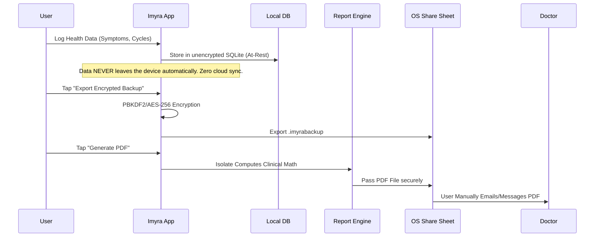

# Clinical & Privacy Specification (Store Guide)

Because Imyra is a strict local-first application designed for clinical compliance and absolute privacy, answering App Store and Google Play privacy questionnaires is incredibly straightforward. Furthermore, Imyra distinguishes itself from standard period trackers by employing clinical phase clustering based on established diagnostic criteria.

## Data Flow & Privacy Model

## Apple App Store: Privacy Nutrition Labels
When submitting to App Store Connect, under **App Privacy**:
- **Data Collection:** NO. "We do not collect data from this app."
- **Health & Fitness:** All data remains on the device. Apple requires you to disclose if you *collect* data off-device. Since Imyra has no backend, the answer is NO.

## Clinical Math & Diagnostic Algorithms

Imyra uses the `ReportDao` to categorize symptoms clinically.

### Phase Visualization Flow

```mermaid
gantt
    title Clinical Cycle Phase Algorithm
    dateFormat  X
    axisFormat %s
    
    section Current Cycle
    Menstrual Phase (Days 0-4)      :active, a1, 0, 4d
    Mid-Cycle Phase (Days 5+)       :a2, 4, 17d
    
    section Next Cycle
    Luteal Phase (Days -7 to -1)    :crit, a3, 21, 7d
    Next Menstrual Phase            :a4, 28, 4d
```

### Premenstrual Dysphoric Disorder (PMDD) Clustering
According to the DSM-5 criteria for PMDD, symptoms must occur in the final week before the onset of menses and begin to improve within a few days after the onset of menses.
1. **Luteal Phase:** Any symptom logged between **Days -7 and -1** relative to the *next* cycle start date is clustered into the Luteal Phase.
2. If a specific symptom occurs in this window across >70% of logged cycles, the algorithm flags it in the PDF Report as `⚠️ Luteal Clustering (PMDD)`.

### Dysmenorrhea & Menstrual Phase Clustering
1. **Menstrual Phase:** Any symptom logged between **Days 0 and 4** relative to the *current* cycle start date.
2. If a symptom falls into this window with >70% frequency, it is flagged as `🩸 Menstrual Clustering`.

### The Importance of `isTrueCycleStart`
Standard tracking apps treat pre-menstrual spotting as Day 1 of a cycle, ruining median cycle length math. Imyra allows users to log spotting without triggering a new cycle (via `isTrueCycleStart = false`), ensuring the Luteal math is anchored to the true physiological start of menstruation.
